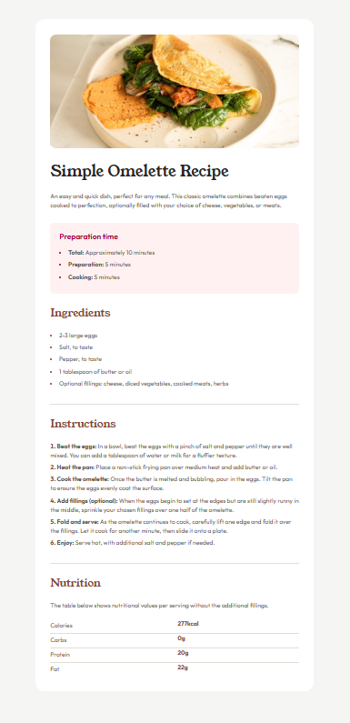

# Frontend Mentor - Recipe page solution

This is a solution to the [Recipe page challenge on Frontend Mentor](https://www.frontendmentor.io/challenges/recipe-page-KiTsR8QQKm). Frontend Mentor challenges help you improve your coding skills by building realistic projects.

## Table of contents

- [Overview](#overview)
  - [The challenge](#the-challenge)
  - [Screenshot](#screenshot)
  - [Links](#links)
- [My process](#my-process)
  - [Built with](#built-with)
  - [What I learned](#what-i-learned)
  - [Continued development](#continued-development)
  - [Useful resources](#useful-resources)
- [Author](#author)
- [Acknowledgments](#acknowledgments)

## Overview

### The challenge

Users should be able to:

- View a well-structured recipe page with clear sections
- See proper spacing and styling using Tailwind CSS
- Navigate a mobile-friendly layout

### Screenshot



### Links

- Solution URL: [Github Repository](https://github.com/HiroanaP/recipe-page.git)
- Live Site URL: [Github Pages](https://hiroanap.github.io/recipe-page/)

## My process

### Built with

- Semantic HTML5 markup
- Tailwind CSS
- Flexbox
- Custom theme configuration in Tailwind
- Mobile-first workflow

### What I learned

This project allowed me to refine my skills in structuring HTML and customizing Tailwind CSS. Some key learnings include:

1. **Using semantic HTML:**
   ```html
   <h1 class="text-[40px] font-title text-stone-800">Simple Omelette Recipe</h1>
   ```
   Using proper heading structures helps improve accessibility and SEO.

2. **Customizing Tailwind theme:**
   ```javascript
   module.exports = {
     theme: {
       extend: {
         colors: {
           brown: {
             800: '#7A4D3A',
           },
         },
       },
     },
   };
   ```
   Custom colors were added to Tailwind to match the design specifications.

### Continued development

In the future, I plan to:
- Improve accessibility further by using ARIA attributes where necessary.
- Enhance responsiveness with more optimized spacing and breakpoints.
- Experiment with Tailwind components for reusability.

### Useful resources

- [Tailwind CSS Documentation](https://tailwindcss.com/docs) - Helped in understanding utility classes and custom theme configurations.
- [MDN Web Docs](https://developer.mozilla.org/en-US/) - Provided insights into best practices for semantic HTML.

## Author

- Frontend Mentor - [@yourusername](https://www.frontendmentor.io/profile/yourusername)
- Twitter - [@yourusername](https://www.twitter.com/yourusername)

## Acknowledgments

Thanks to Frontend Mentor for providing structured challenges that help improve frontend development skills!

